# Overall Architecture Mermaid

Status: normative overview

Last updated: 2026-06-25

## 1. Purpose

This document provides a single Mermaid overview of the Agent-OS architecture.

It is a navigation aid for the rest of the design set, not a replacement for the normative subsystem documents.

## 2. Diagram

```mermaid
flowchart TB
    human["Human / API / UI"]
    api["Agent-OS API Server"]
    human --> api

    subgraph kernel["Agent-OS Kernel (Control Plane)"]
        acb["Agent Control Block Manager"]
        sched["Scheduler and Resource Arbitration"]
        role["Role and Profile System"]
        dag["Task DAG Manager"]
        blackboard["Typed Blackboard"]
        env["Execution Environment System"]
        comm["Communication Kernel"]
        provider["Provider System"]
        context["Context Manager"]
        memento["Memento Manager"]
        memory["Memory Manager"]
        tool["Tool Broker"]
        perm["Permission Kernel"]
        evidence["Evidence Store"]
        artifact["Artifact Store"]
        review["Review Runtime"]
        conflict["Conflict Resolver"]
        audit["Audit Log"]
    end

    subgraph runtime["Agent Thread Runtime"]
        supervisor["SupervisorAgent"]
        worker["WorkerAgent"]
        reviewer["ReviewerAgent"]
    end

    subgraph execution["Drivers / Services / Data Plane"]
        llm["LLM Providers"]
        mcp["MCP Servers"]
        shell["Shell Tools"]
        fs["File Systems"]
        git["Git Providers"]
        browser["Browsers"]
        db["Databases"]
        enterprise["Enterprise APIs"]
    end

    subgraph storage["Durable State and Blobs"]
        sqlite["SQLite Driver"]
        postgres["PostgreSQL Driver"]
        objectstore["Object Storage"]
        events["Append-Only Events"]
        projections["State Projections"]
        blobs["Artifacts / Evidence Blobs"]
    end

    subgraph distro["Distribution Layer"]
        distro_manifest["Distro Manifest"]
        role_packages["Role Packages"]
        policy_packs["Policy Packs"]
        env_templates["Environment Templates"]
        tool_drivers["Tool Drivers"]
        console["Operational Console / CLI"]
    end

    api --> kernel
    kernel --> runtime
    runtime --> kernel

    role --> supervisor
    role --> explorer
    role --> coder
    role --> tester
    role --> reviewer
    role --> verifier

    sched --> runtime
    dag --> sched
    blackboard --> runtime
    context --> runtime
    memento --> runtime
    memory --> runtime
    perm --> tool
    perm --> comm
    perm --> env
    provider --> llm
    tool --> mcp
    tool --> shell
    tool --> fs
    tool --> git
    tool --> browser
    tool --> enterprise
    env --> fs
    env --> shell
    runtime --> tool
    runtime --> provider
    runtime --> comm
    runtime --> blackboard
    runtime --> artifact
    runtime --> evidence
    runtime --> review

    acb --> events
    sched --> events
    role --> events
    env --> events
    comm --> events
    provider --> events
    artifact --> blobs
    evidence --> blobs
    audit --> events
    events --> projections
    sqlite --> projections
    postgres --> projections
    objectstore --> blobs

    distro_manifest --> role_packages
    distro_manifest --> policy_packs
    distro_manifest --> env_templates
    distro_manifest --> tool_drivers
    role_packages --> role
    policy_packs --> perm
    policy_packs --> sched
    env_templates --> env
    tool_drivers --> tool
    console --> api
    db --> sqlite
    db --> postgres
```

## 3. Reading Guide

- `Human / API / UI -> Agent-OS API Server -> Agent-OS Kernel` is the control entry path.
- `Agent Thread Runtime` is the execution unit layer, but it never owns kernel truth.
- `Drivers / Services / Data Plane` contains effectful integrations reached through Provider System, Tool Broker, or Execution Environment System.
- `Durable State and Blobs` holds replayable control-plane state and immutable artifact or evidence payloads.
- `Distribution Layer` customizes Agent-OS without redefining kernel semantics.

## 4. Canonical Follow-Up Docs

- [System Architecture](system-architecture.md)
- [Agent Thread Core Module](agent-thread-core-module.md)
- [Role and Profile System](role-and-profile-system.md)
- [Execution Environment System](execution-environment-system.md)
- [Scheduler and Resource Arbitration](scheduler-and-resource-arbitration.md)
- [Provider System](provider-system.md)
- [Kernel Data Model](kernel-data-model.md)
- [Kernel ABI and Syscalls](kernel-abi-and-syscalls.md)
