# Overall Architecture Mermaid

Status: normative overview

Last updated: 2026-07-01

## 1. Purpose

This document provides a single Mermaid overview of the current Agent-OS architecture.

It is a navigation aid for the rest of the design set, not a replacement for the normative subsystem documents.

## 2. Diagram

```mermaid
flowchart TB
    subgraph entry["Clients and Entry Points"]
        human["Human operator"]
        automation_client["Automation / app client"]
        cli["agent-os-cli<br/>chat, run, code, resume, status"]
        jsonl_client["JsonlAppClient<br/>AppRequestEnvelope / AppResponseEnvelope"]
    end

    subgraph app_boundary["App Protocol Boundary"]
        app_abi["agent-os-sys app ABI<br/>AppRequest, AppResponse, AppNotification"]
        app_server["agent-os-app-server<br/>JSONL protocol gate"]
        subscriptions["Subscriptions<br/>ProjectionCursor replay"]
    end

    subgraph daemon["agent-os-kerneld Service"]
        kerneld["KernelDaemon<br/>long-running service owner"]
        runtime_queue["RuntimeJobRecord queue<br/>queued, running, completed, failed"]
        runtime_workers["Runtime worker registry<br/>background ThreadRuntime workers"]
        runtime_config["Runtime model config<br/>external process or provider config"]
        notifier["Notification projector<br/>events to AppNotification"]
    end

    subgraph kernel["agent-os-kernel Authoritative Control Plane"]
        kernel_state["Kernel state and reducers<br/>goals, tasks, ATCBs, turns"]
        profiles["Profiles and policy<br/>roles, permissions, sandbox, provider, communication"]
        resources["Resources and automation<br/>leases, sessions, schedules, runs"]
        ecosystem_state["Ecosystem state<br/>instructions, skills, commands, MCP metadata"]
        provider_records["Provider records<br/>stream events, usage, model aliases"]
        tool_broker["Tool Broker and Permission Kernel<br/>descriptor policy, approval, execution admission"]
        evidence_artifacts["Evidence, artifacts, review, verification<br/>final submission gates"]
        blackboard_comm["Blackboard and communication<br/>supervisor reports, human asks, scoped posts"]
    end

    subgraph runtime["agent-os-thread Runtime"]
        thread_runtime["ThreadRuntime<br/>normal Agent Thread loop"]
        model_context["ModelContextProjection<br/>tool descriptors, prior results, artifacts, evidence"]
        model_clients["Model clients<br/>ExternalProcessModelClient / OpenAiModelClient"]
        openai_adapter["OpenAI and Anthropic-compatible adapters<br/>message, tool schema, parser"]
    end

    subgraph tools["Built-In Tool Data Plane"]
        builtin_tools["Kernel-owned built-in tools<br/>read_file, apply_patch, run_command<br/>control-plane tools, submit_final"]
        workspace["Workspace files and patches"]
        shell["Local commands and process output"]
        skill_files["Skill and instruction resources"]
        child_agents["Supervised child agent control"]
    end

    subgraph storage["Durable State, Projections, and Blobs"]
        store_traits["agent-os-store traits<br/>EventStore, ProjectionStore, IdempotencyStore, BlobStore"]
        sqlite["agent-os-store-sqlite<br/>events, migrations, idempotency, projections"]
        events["Append-only event stream"]
        projections["Durable app projections<br/>threads, turns, timeline, stats, approvals,<br/>resources, automations, artifacts, evidence"]
        blobs["Artifact and evidence blobs"]
    end

    subgraph external["External Inputs and Services"]
        provider_config["Global providers.json<br/>provider, base_url, model, api_style"]
        llm["LLM provider endpoints"]
        external_model["External model process"]
        workspace_ecosystem["Workspace ecosystem inputs<br/>AGENTS.md, CLAUDE.md, skills, commands, MCP metadata"]
    end

    human --> cli
    human --> jsonl_client
    automation_client --> jsonl_client
    cli --> jsonl_client
    cli -->|"spawns or connects to --stdio"| kerneld
    jsonl_client -->|"JSONL stdin/stdout"| app_server
    app_server -->|"responses and notifications"| jsonl_client
    app_abi -. shared transport types .-> jsonl_client
    app_abi -. shared transport types .-> app_server
    app_server --> subscriptions
    app_server -->|"AppKernelService"| kerneld
    notifier --> app_server

    kerneld --> kernel_state
    kerneld --> runtime_queue
    kerneld --> runtime_config
    kerneld --> notifier
    kerneld -->|"thread/read, list, stats, bundle export"| projections
    kerneld -->|"run due automations"| resources

    kernel_state --> profiles
    kernel_state --> resources
    kernel_state --> ecosystem_state
    kernel_state --> provider_records
    kernel_state --> tool_broker
    kernel_state --> evidence_artifacts
    kernel_state --> blackboard_comm

    runtime_queue --> runtime_workers
    runtime_workers --> thread_runtime
    runtime_config --> runtime_workers
    thread_runtime --> model_context
    model_context --> model_clients
    openai_adapter --> model_clients
    model_clients --> llm
    model_clients --> external_model
    provider_config --> runtime_config
    thread_runtime -->|"provider events and usage"| provider_records
    thread_runtime -->|"state transitions, checkpoints, finalization"| kernel_state
    thread_runtime -->|"tool proposals through kernel"| tool_broker

    tool_broker --> builtin_tools
    builtin_tools --> workspace
    builtin_tools --> shell
    builtin_tools --> skill_files
    builtin_tools --> child_agents
    builtin_tools --> evidence_artifacts
    builtin_tools --> blackboard_comm

    workspace_ecosystem -->|"import_workspace_ecosystem"| ecosystem_state
    ecosystem_state --> model_context
    ecosystem_state --> tool_broker

    kernel_state --> store_traits
    store_traits --> sqlite
    store_traits --> blobs
    sqlite --> events
    sqlite --> projections
    events --> projections
    projections --> notifier
    evidence_artifacts --> blobs
```

## 3. Reading Guide

- App clients and `agent-os-cli` talk through the `agent-os-app-server` JSONL protocol. The CLI starts or connects to `agent-os-kerneld --stdio` and sends typed `AppRequest` envelopes.
- `agent-os-kerneld` is the long-running service boundary. It opens the SQLite-backed kernel store, owns `KernelDaemon`, manages runtime job records and worker threads, serves app projections, and emits cursor-based notifications.
- `agent-os-kernel` remains the only authority for state transitions, profiles, permissions, resources, automation, tool descriptors, evidence, artifacts, review, verification, and final submission gates.
- `agent-os-thread` runs model turns from daemon-owned runtime jobs. It builds `ModelContextProjection` from kernel state, calls the configured model client, and returns every effect through kernel syscalls or the Tool Broker.
- Built-in tools are kernel-owned descriptors and drivers. Workspace reads, patches, commands, child-agent control, human asks, blackboard posts, evidence records, and `submit_final` all pass through descriptor policy and permission checks.
- Storage is event-first. The SQLite driver persists append-only events, idempotent syscall results, projection tables, and blob references; app reads and notifications are served from durable projections.
- Ecosystem inputs such as `AGENTS.md`, `CLAUDE.md`, skills, commands, and MCP metadata are imported into typed kernel state and projected into runtime context. They do not replace kernel authority.

## 4. Canonical Follow-Up Docs

- [System Architecture](system-architecture.md)
- [Agent Thread Runtime](agent-thread-runtime.md)
- [Agent Thread Core Module](agent-thread-core-module.md)
- [Role and Profile System](role-and-profile-system.md)
- [Execution Environment System](execution-environment-system.md)
- [Scheduler and Resource Arbitration](scheduler-and-resource-arbitration.md)
- [Provider System](provider-system.md)
- [Permission, Tool, and Evidence Model](permission-tool-evidence-model.md)
- [State, Storage, and Replay](state-storage-and-replay.md)
- [Kernel Data Model](kernel-data-model.md)
- [Kernel ABI and Syscalls](kernel-abi-and-syscalls.md)
